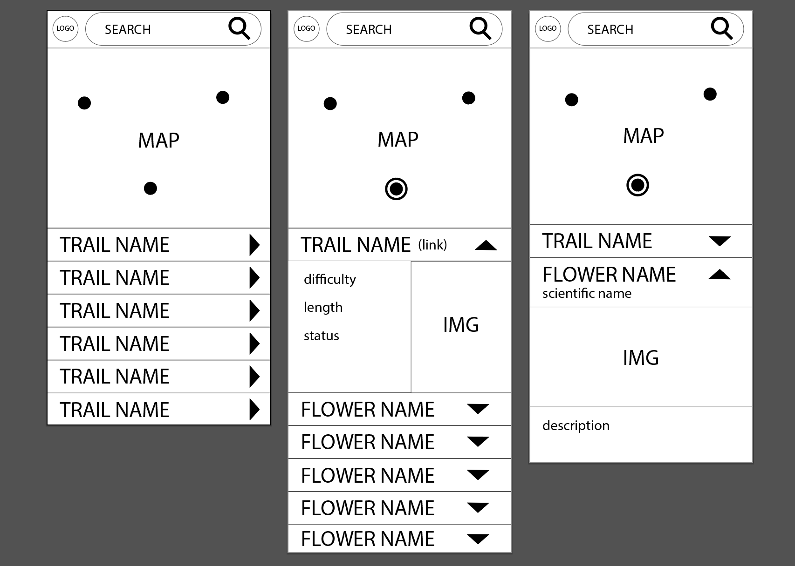

# Bloom Trek 

Bloom Trek allows users to find out what flowers are blooming and what hikes they can take to see them. The app displays parks near the user's current location and the corresponding blooming plants in that area for the current (or chosen) month. Trails within a 10 mile radius of the park are displayed as well. Bloom Trek was built with [React Native](https://facebook.github.io/react-native/) using [Expo](https://expo.io/). Test suite uses [Jest](https://jestjs.io/) and [Enzyme](https://airbnb.io/enzyme/). Corresponding API can be found [here](https://github.com/brickstar/bloomtrek-api).

## Set Up

#### Prerequisites

* Make sure you have [NodeJS](https://nodejs.org/en/download/) and [Xcode](https://developer.apple.com/xcode/) installed 
* Install the Expo Cli if you don't have it already --> ``npm install expo-cli --global``
* You will need a Google Maps API key - follow instructions [HERE](https://developers.google.com/maps/documentation/javascript/get-api-key)

#### Installation

1.  ``git clone https://github.com/laurakwhit/bloom-trek.git``

1.  ``cd bloom-trek``

1. ``touch .env ``

1.  Open .env in your editor and add your Google API key --> ``GOOGLE_KEY=[your-api-key]``

1.  ``expo start``

1.  A browser window will pop up - choose **Run on iOS simulator**

1.  *Optional* --> Use [Expo Client](https://expo.io/tools#client) on your device and scan the QR code in browser window.

#### Test Suite
* Run the following command --> ``npm test``

## Wireframes

## Result

|   |  | 				|
| ------------- | ------------- | -------------

## Contributors

##### Front-End
- [Laura Whitaker](https://github.com/laurakwhit)
- [Chris Boylen](https://github.com/chrisboylen)

##### Back-End ([link to repo](https://github.com/brickstar/bloomtrek-api))
- [Keegan Corrigan](https://github.com/keegancorrigan)
- [Matt Bricker](https://github.com/brickstar)
